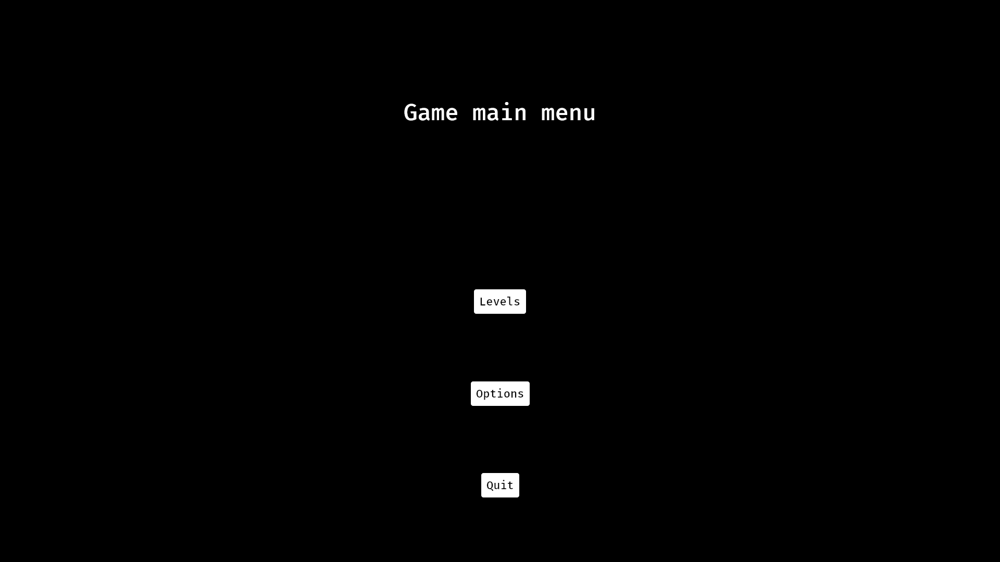
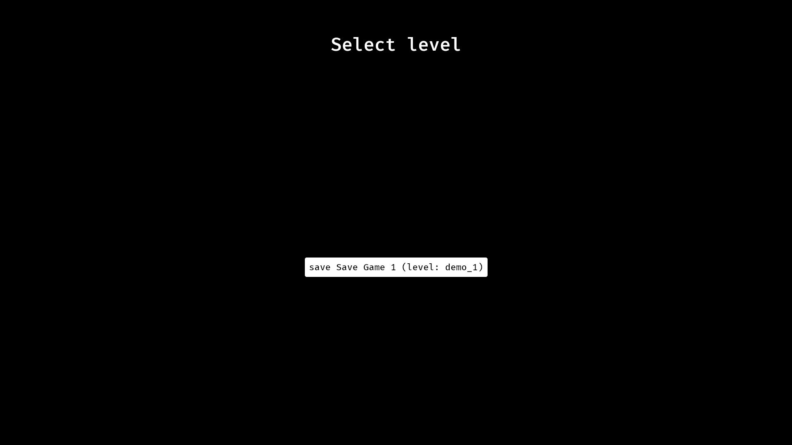
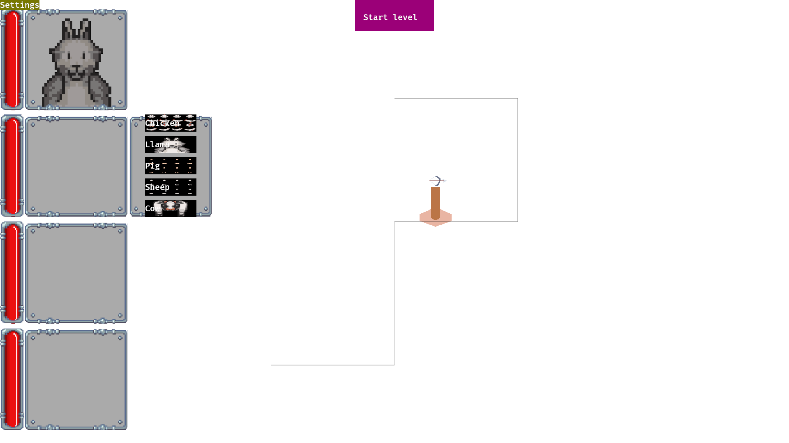
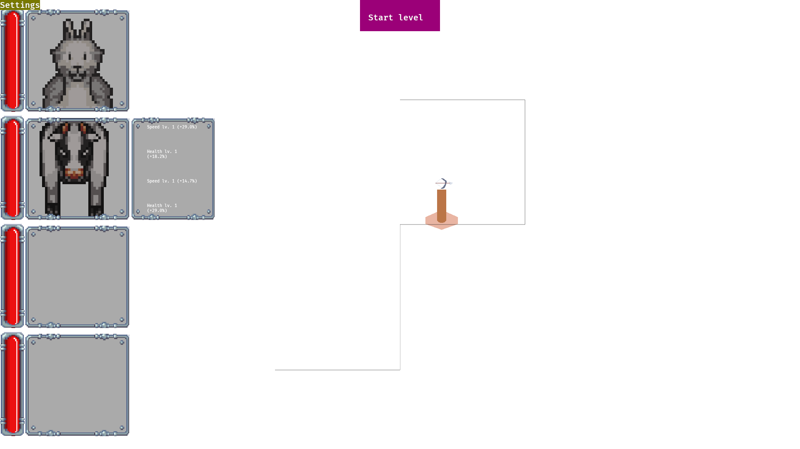
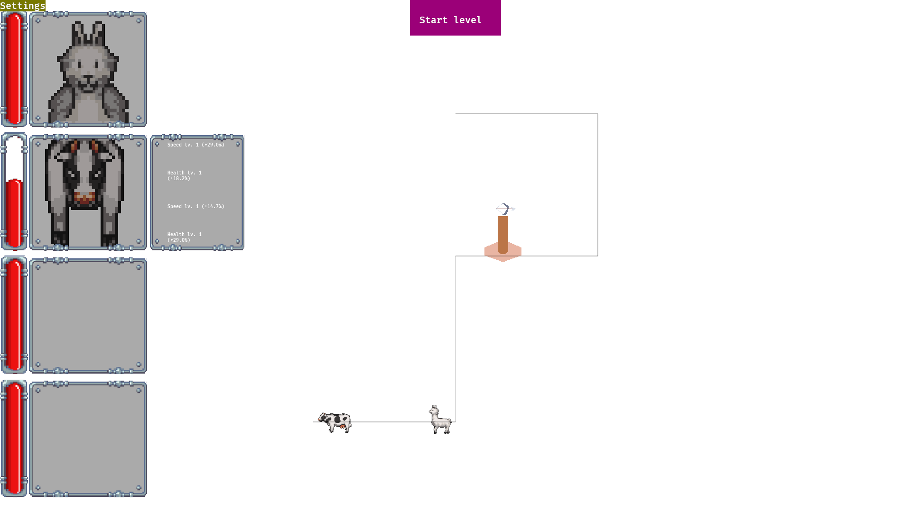

# Milestone report 3 – Alpha
Video Game Design - Project

## General information
Team members: Mateusz Domalewski
Title: Animal Rush (work in progress)
Genre: Tower offense
Platform: linux (windows / web hopefully next)

## Theme and setting of the game
Shortly (maximum 2-3 sentences per section), describe the goal of the game, theme,
locations (worlds, levels, style), lore (backstory, main plots), and characters.
### Goal

### Theme and Locations

### Lore

### Characters

## Tasks scheduled for this stage during the previous stage

| Id | Task description | Who | Comments |
| --- | --------------- | --- | -------- |
| 1 | UI / HUD improvements | MD | improve HUD textures and add extra functionality required |
| 2 | animations | MD | add some dialogs / animations and level progression mechanics |
| 3 | game state options | MD | add options to load and later save game state to disk |
| 4 | character upgrades | MD | add upgrade options for game characters |

## Tasks addressed during this stage

| Id | Task description | Who | Status | Comments |
| --- | --------------- | --- | ------ | -------- |
| 1 | UI / HUD improvements | MD | Need fixing | components and improvements are added but still need some necessary functionality |
| 2 | animations | MD | In progress | options for next level and level sequences have been added to game state but some critical functionality is still missing |
| 3 | game state options | MD | In Progress | Level select has been migrated to game save select but option to make new same and working save functionality are still in development |
| 4 | character upgrades | MD | Need fixing | character upgrades have been added with random rolls and available selection in UI but applying upgrade logic needs to be made working |

## Screenshots

main menu:

save select:

level character select:

level upgrade select:

level gameplay:

## Plan for the next stage

| Id | Task description | Who |
| -- | ---------------- | --- |
