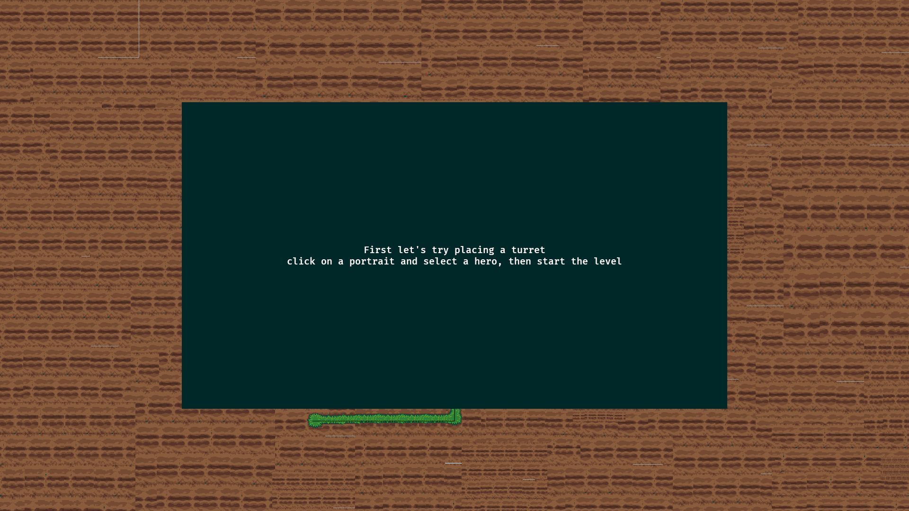
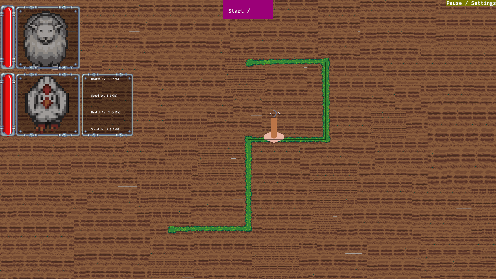
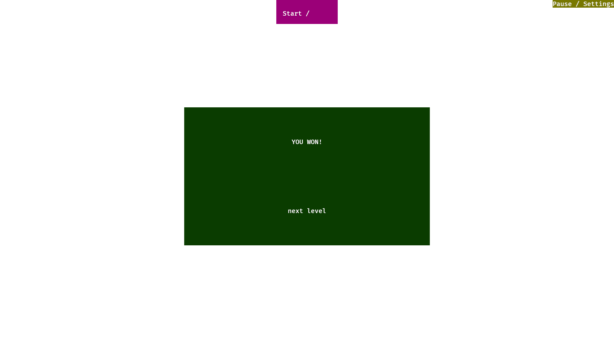

# Milestone report 3 – Beta

Video Game Design - Project

## General information

Team members: Mateusz Domalewski

Title: Animal Rush (work in progress)

Genre: Tower offense

Platform: linux / web (on itch.io)

## Theme and setting of the game

Shortly (maximum 2-3 sentences per section), describe the goal of the game,
theme, locations (worlds, levels, style), lore (backstory, main plots), and
characters.

### Goal

Finish all of the levels within one save to win the game. Upgrade and select
character on each level to fit the challenges.

### Theme and Locations

Theme is animals breaking out of holding. Locations will be various holding
location such as shelter, zoo etc.

### Lore

### Characters

current animal heroes available include chicken, llama, cow, sheep and pig. Each
character has unique stats like speed and health which will enable combinations
to beat different levels.

## Tasks scheduled for this stage during the previous stage

| Id | Task description               | Who | Comments                                                    |
| -- | ------------------------------ | --- | ----------------------------------------------------------- |
| 5  | Fix ui/hud save functionality  | MD  | started work on this but not sure how it should work on web |
| 6  | finish level transitions       | MD  | mostly done via state machines / need final credits         |
| 7  | finish load/save functionality | MD  | same as task 5                                              |
| 8  | fix applying upgrades          | MD  | needed for full fonctionality                               |

## Tasks addressed during this stage

| Id | Task description               | Who | Status               | Comments                                                                              |
| -- | ------------------------------ | --- | -------------------- | ------------------------------------------------------------------------------------- |
| 5  | Fix ui/hud save functionality  | MD  | need triage          | UI works but needs triage in order to determine implementation for Web release        |
| 6  | finish level transitions       | MD  | done / needs triage  | done, credits state and display can be added                                          |
| 7  | finish load/save functionality | MD  | done/needs triage    | basic functionality is done and needs triage for targeting web platform               |
| 8  | fix applying upgrades          | MD  | done/can be upgraded | Done in accordance to task 4                                                          |
| 1  | UI / HUD improvements          | MD  | In progress          | hud looks nice and clean, some can still be upgraded                                  |
| 2  | animations                     | MD  | In progress          | more animations / particle effects for clarity required                               |
| 3  | game state options             | MD  | Done                 | game fully transitions, only state missing in the credits                             |
| 4  | character upgrades             | MD  | Done                 | random rolls migrated to static, applying upgrades works and limits on upgrade points |

## Current game build

[beta release (itch.io)](https://matt022.itch.io/animal-rush)

## Screenshots

dialogue pre level: 

applying hero upgrades on levels: 

victory post screen with next level progression:

## Plan for the next stage

| Id | Task description                  | Who |
| -- | --------------------------------- | --- |
| 9  | triage save functionality         | MD  |
| 10 | functional settings               | MD  |
| 11 | music/animations/particle effects | MD  |
| 12 | polish HUD and assets             | MD  |
